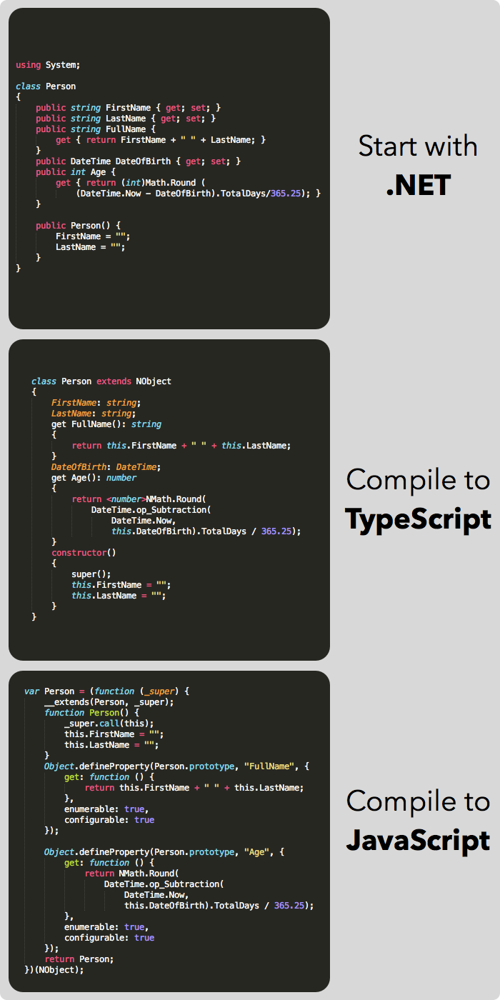

# Netjs

Netjs is a .NET to TypeScript and JavaScript compiler. It uses multiple stages to produce JavaScript for your web apps.

You start by compiling whatever code you want into its own assembly. Portable Class Libraries work great for this, but it really doesn't matter. You can even pass EXEs.

    netjs Library.dll

This produces a TypeScript file. You can use this file as is if the rest of your app is written in TypeScript.

If you want JavaScript (with no dependencies), then pass this file along with a tiny mscorlib to the TypeScript compiler:

    tsc -t ES5 mscorlib.ts Library.ts --out Library.js

You can now include Library.js in any app because it is fully linked (you will get build errors if anything is missing).

    

And that's it. You can write apps and reuse the portable parts in web apps!

## Installation

### Install Netjs

Download it:

    git clone https://github.com/praeclarum/Netjs.git

#### Mac

    sudo make install

This will install a soft link called `netjs` in `/usr/bin` to the script `netjs.sh`.

#### Windows

    msbuild

`Netjs.exe` will be built in `Netjs\bin\Debug`. You can copy this executable to someplace in your PATH to make it readily available.

### Install Node

[http://nodejs.org/download/](http://nodejs.org/download/)

Node is needed by the TypeScript compiler.

### Install TypeScript

    sudo npm install -g typescript

## Compiling Code

Netjs works with .NET assemblies built with any compiler ([limitations][Limitations] not withstanding).

### Compile to TypeScript

    netjs Library.dll

This will output a TypeScript file named `Library.ts` containing all the code from `Library.dll` and any other assemblies referenced in its directory.

### Compile to JavaScript

    tsc -t ES5 mscorlib.ts Library.ts --out Library.js 

This compiles the library code along with a small implementation of mscorlib. The files are merged and output as a single JavaScript file `Library.js`.

### ECMAScript 3 Compatibility

In case you need your code to run in es3 environment (like, well, IE8), you have to get rid of accessors as they are not supported.
Passing `--es3` as an argument would result in creating of getter/setter methods instead of fields with accessors.

    netjs Library.dll --es3
    
Library.dll:

    class Person
    {
        private string name;
        public string Name
        {
            get { return name; }
            set { name = value; }
        }
    }

Library.ts:

    class Person extends NObject
    {
        name: string;
        SetName(value: string): void
        {
            this.name = value;
        }
        GetName(): string
        {
            return this.name;
        }
    }

And then compile TypeScript for ES3. Also use es3 compatible mscorlib.

    tsc -t ES3 mscorlib.es3.ts Library.ts --out Library.js

Since all the references and assignments of all fields with accessors, including native ones, are replaced with methods invocations, you have to provide a corresponding implementation. In `mscorlib.es3.ts` all accessors are replaced with getter/setter methods.

## Philosophy

[History][] is filled with other IL to JS compilers, why Netjs?

Because I am not happy with the JavaScript generated by current solutions.

The best solutions currently generate a lot of code in an attempt to maintain all the finer points of .NET semantics. The philosophy of Netjs is that .NET and JavaScript's semanantics are *close enough* that idiomatic JavaScript can be generated from any .NET library. Sure we have to work around some of .NET's features, but the majority of code should be clean JavaScript. 

Well, that's almost true - JavaScript's idioms don't exactly match .NET's. However, TypeScript's come a lot closer. For this reason, Netjs leverages the TypeScript compiler. This also performs a great "first unit test" on the generated code because the TypeScript compiler is very strict and is good at catching errors.

When I declare a class with properties in C#,

    class Person {
        public DateTime DateOfBirth { get; set; }
        public int Age {
            get {
                var now = DateTime.Now;
                return (new DateTime (dob.Year,now.Month,now.Day) >= dob) ? 
                    now.Year - dob.Year : 
                    now.Year - dob.Year - 1;
            }
        }
    }

The code generated should be idiomatic JavaScript. And it is:

    var Person = (function (_super) {
        __extends(Person, _super);
        function Person() {
            _super.call(this);
            this.DateOfBirth = null;
        }
        Object.defineProperty(Person.prototype, "Age", {
            get: function () {
                var now = DateTime.Now;
                var flag = DateTime.op_GreaterThanOrEqual(new DateTime(this.DateOfBirth.Year, now.Month, now.Day), this.DateOfBirth);
                return (!flag) ? (now.Year - this.DateOfBirth.Year - 1) : (now.Year - this.DateOfBirth.Year);
            },
            enumerable: true,
            configurable: true
        });
        return Person;
    })(NObject);

There's a tiny wrapper placed around the class definition that is typical of JavaScript code avoiding name conflicts. There is the use of a tiny `__extends` function that establishes a class hierarchy using JavaScript's prototype chain. The rest is standard JavaScript.

I want to make life easier for the machine by generating clean idiomatic code, but I also want it to be easier for us developers. 

When it comes time to use the Person class from JavaScript, that code should also be clean and idiomatic:

    

## History

Netjs is not the first project that compiles .NET IL to JavaScript. It is, in fact, my second attempt at such an app. The first worked, but wasn't good enough for release.

Microsoft built their own named Project V. It was glorious, as was the amount of JavaScript it created. "Hello world" generated gigabytes of JavaScript. Serisously, I once calculated that the heat death of the universe would occur before it had finished outputting a foreach loop. You see, the JavaScript it output rigorously obeyed .NET semantics - it was as if a virtual machine vomitted all over your code. Glorious. Anyway, Microsoft cancelled the project.

Then the world was blessed with [JSIL][]. This is Project V done right. It's still a virtual machine vomitting all over your code, but it's a clean nice kind of vomit that is measured in megabytes instead of gigabytes. It's powerful enough to compile the BCL and MonoGame - a truly powerful compiler. It's going to generate a lot code and you're might end up with a loading screen, but it does its job well.

## Limitations

* **Namespaces are ignored**
* mscorlib.ts is a **tiny subset** of the full BCL
* **Overloaded methods** generally work, but have trouble with:
    - One overload being virtual and another not (it hurts my head trying to get this to work)
    - Overloads that have the same argument count and accept values that can be null (runtime type checking is used)
    - Overloaded constuctors that call different base constructors probably don't work
* **Async** does not work
* **Gotos** only sometimes work
* **Regexes** have some problems:
    - Named groups don't work (we rely on the browser's regex implementation)
    - Match Group Index only works if you capture everything
* Integer casts with the expectation of performing a Truncate operation don't work ()
* **Seriously,** watch it with those overloads

If any of these bother you, then please go use [JSIL][]. 

[JSIL]: http://jsil.org

## Thank you!

Netjs owes the majority of its intelligence to [Mono.Cecil][cecil], [NRefactory][], and [ILSpy][]'s decompiler. Without these projects, Netjs would not exist. Thank you!

[cecil]: http://mono-project.com/Cecil
[NRefactory]: https://github.com/icsharpcode/NRefactory
[ILSpy]: http://ilspy.net

## License

**The MIT License (MIT)**

Please see <a href="LICENSE.txt">LICENSE.txt</a> for details.
